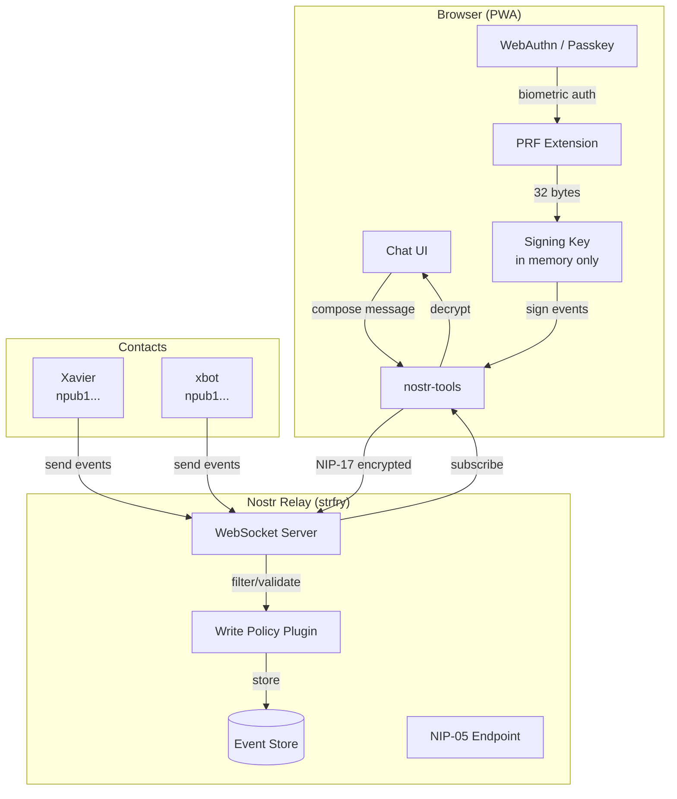
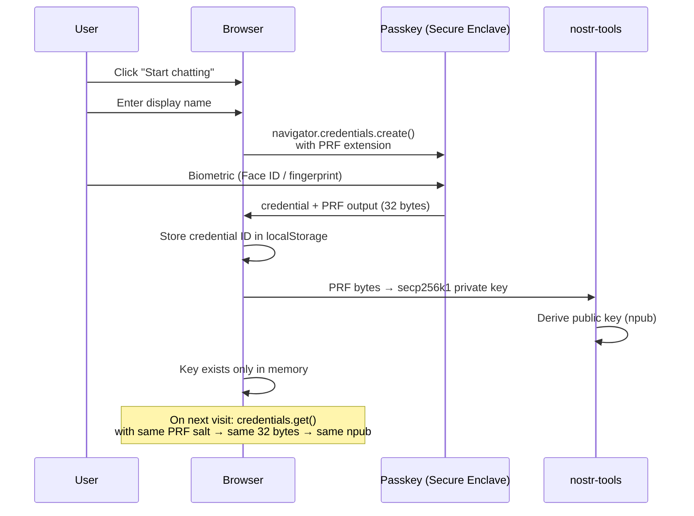
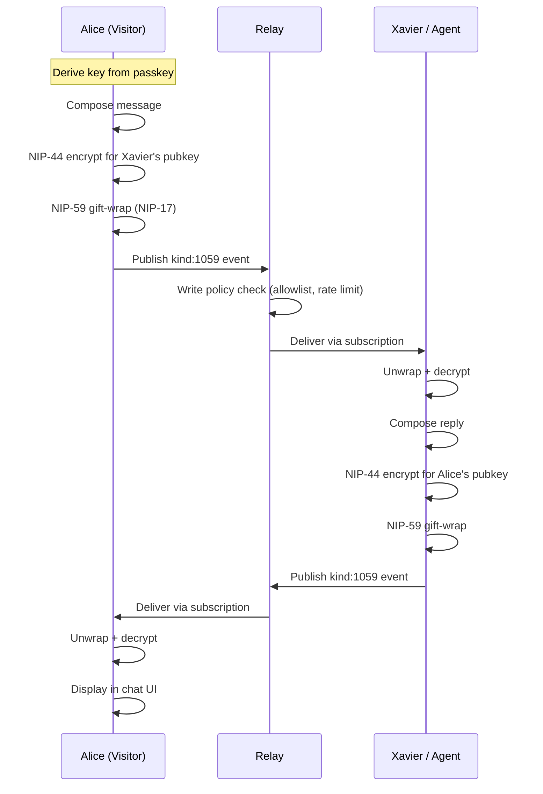

# Architecture

## Overview

QuickChat is a static PWA that connects directly to Nostr relays. There is no application server — all cryptographic operations happen client-side in the browser.



## Key Derivation



### PRF Salt Strategy

The PRF salt determines the derived key. QuickChat uses a fixed, well-known salt:

```
salt = SHA-256("quickchat:nostr:v1")
```

This means:
- Same passkey → same Nostr identity (across devices via passkey sync)
- Different passkeys → different Nostr identities
- The salt is not secret — it's a domain separator

### Firefox Fallback

Firefox doesn't support PRF yet. Fallback strategy:

1. Generate a random nsec on first visit
2. Encrypt it with a key derived from the passkey signature (using HKDF)
3. Store the encrypted blob in localStorage
4. On login, decrypt with the passkey → recover nsec

This is less elegant (identity doesn't survive clearing localStorage) but functional.

## Message Flow



## Rate Limiting

Rate limits are enforced **client-side** (honor system for MVP) and **relay-side** (enforced via write policy plugin).

### Client-side

The PWA tracks message counts in localStorage:

```json
{
  "rateLimits": {
    "day": { "count": 12, "resetAt": "2026-04-01T00:00:00Z" },
    "week": { "count": 45, "resetAt": "2026-04-07T00:00:00Z" },
    "month": { "count": 120, "resetAt": "2026-05-01T00:00:00Z" }
  }
}
```

When a limit is reached, the compose input is disabled with a message explaining when it resets.

### Relay-side (strfry write policy)

```bash
#!/bin/bash
# /etc/strfry/policies/rate-limit.sh
# strfry calls this with event JSON on stdin
# Return {"action":"accept"} or {"action":"reject","msg":"reason"}
```

The write policy plugin tracks events per pubkey and enforces the same limits server-side. This prevents someone from bypassing the client-side limits.

## Data Storage

### Browser (IndexedDB)

| Store | Contents |
|-------|----------|
| `messages` | Decrypted message history (sender, text, timestamp, eventId) |
| `contacts` | Contact list with metadata |
| `identity` | Credential ID, display name, npub (NOT nsec) |

The nsec is **never persisted**. It's derived fresh from the passkey on each session.

### Relay

Standard Nostr event storage. QuickChat doesn't require any relay-side customization beyond:
- Write policy plugin for rate limiting
- NIP-05 endpoint (optional, can be a static JSON file)

## Security Model

| Threat | Mitigation |
|--------|-----------|
| Server compromise | No server holds keys. Relay stores only encrypted (NIP-17) events. |
| XSS | nsec exists only in JS memory, never in localStorage/IndexedDB. CSP headers block inline scripts. |
| Passkey theft | Requires biometric + device access. Passkeys can't be phished (bound to origin). |
| Relay operator reads DMs | NIP-17 gift-wrapping hides sender, recipient, and content from relay. |
| Spam | Rate limiting at client + relay level. Contacts are an allowlist. |
| Identity loss | Passkey syncs via iCloud/Google. Optional: export nsec backup (encrypted). |

## Project Structure

```
quickchat/
├── index.html
├── vite.config.ts
├── config.json                 # Deployment config (relay, contacts, limits)
├── public/
│   ├── manifest.json           # PWA manifest
│   └── icons/                  # App icons
├── src/
│   ├── main.tsx                # Entry point
│   ├── App.tsx                 # Router + layout
│   ├── components/
│   │   ├── Onboarding.tsx      # Name + passkey creation
│   │   ├── ContactList.tsx     # Available contacts
│   │   ├── ChatView.tsx        # Message thread
│   │   ├── ComposeBar.tsx      # Message input + rate limit display
│   │   └── Settings.tsx        # Identity info, export key, logout
│   ├── lib/
│   │   ├── passkey.ts          # WebAuthn + PRF key derivation
│   │   ├── nostr.ts            # Event creation, NIP-17, relay connection
│   │   ├── crypto.ts           # NIP-44 encryption, gift-wrapping
│   │   ├── storage.ts          # IndexedDB helpers
│   │   └── rate-limit.ts       # Client-side rate limit tracking
│   ├── hooks/
│   │   ├── useIdentity.ts      # Passkey auth + key derivation
│   │   ├── useRelay.ts         # WebSocket connection management
│   │   └── useMessages.ts      # Message send/receive + decrypt
│   └── config.ts               # Load and validate config.json
├── docs/
│   ├── architecture.md         # This file
│   ├── protocol.md             # Nostr NIPs reference
│   ├── deployment.md           # Self-hosting guide
│   └── wireframes.md           # UI flow
└── relay/
    └── rate-limit-policy.sh    # strfry write policy plugin
```
