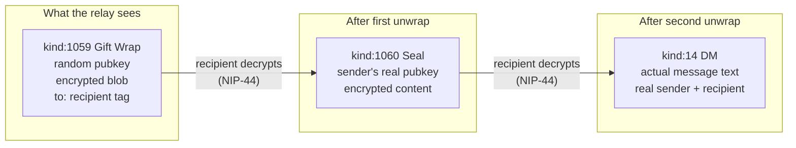

# Protocol — Nostr NIPs Used

QuickChat uses a minimal set of Nostr NIPs to implement private messaging.

## Core NIPs

### NIP-01 — Basic Protocol

Foundation. Events, filters, relay communication.

```json
{
  "id": "<sha256 of serialized event>",
  "pubkey": "<sender's public key>",
  "created_at": 1234567890,
  "kind": 1059,
  "tags": [],
  "content": "<encrypted>",
  "sig": "<schnorr signature>"
}
```

Client communicates with relay via WebSocket:
- `["REQ", "<sub_id>", <filter>]` — subscribe to events
- `["EVENT", <event>]` — publish an event
- `["CLOSE", "<sub_id>"]` — close subscription

### NIP-17 — Private Direct Messages

The messaging layer. Replaces the deprecated NIP-04.

NIP-17 uses **gift-wrapping** (NIP-59) to hide metadata:



**Why gift-wrapping matters:**
- Relay cannot see who sent the message (random ephemeral pubkey on outer layer)
- Relay cannot see the content
- Relay can only see the recipient (needed for delivery)

### NIP-44 — Encryption (v2)

Replaces NIP-04's AES-CBC. Uses:
- **ChaCha20-Poly1305** — AEAD cipher
- **HKDF-SHA256** — key derivation
- **secp256k1 ECDH** — shared secret from sender privkey + recipient pubkey

```
shared_secret = ECDH(sender_privkey, recipient_pubkey)
conversation_key = HKDF-SHA256(shared_secret, salt="nip44-v2")
nonce = random(24 bytes)
ciphertext = ChaCha20-Poly1305(conversation_key, nonce, plaintext)
```

### NIP-59 — Gift Wrap

The metadata protection layer used by NIP-17:

1. Create the actual DM event (kind:14, unsigned)
2. **Seal** it: encrypt with NIP-44 using sender's real key → kind:1060
3. **Gift-wrap** it: encrypt the seal with a random ephemeral key → kind:1059
4. Add `["p", "<recipient_pubkey>"]` tag to the gift-wrap (so relay knows who to deliver to)

### NIP-05 — DNS Identifiers

Maps `name@domain` to a Nostr pubkey. QuickChat can optionally serve NIP-05 for registered users.

```
GET https://chat.yourdomain.com/.well-known/nostr.json?name=alice
```

```json
{
  "names": {
    "alice": "hex_pubkey_here"
  }
}
```

For the MVP, this is a static JSON file updated when users register.

## Event Kinds Used

| Kind | NIP | Purpose |
|------|-----|---------|
| 14 | NIP-17 | Direct message (inner, never published raw) |
| 1059 | NIP-59 | Gift wrap (outer layer, what relay stores) |
| 1060 | NIP-59 | Seal (middle layer, encrypted) |
| 0 | NIP-01 | Profile metadata (optional, for display name) |
| 10002 | NIP-65 | Relay list metadata (optional) |

## Relay Filters

QuickChat subscribes to incoming messages with:

```json
["REQ", "inbox", {
  "#p": ["<user_pubkey_hex>"],
  "kinds": [1059],
  "since": <last_seen_timestamp>
}]
```

And publishes outgoing messages as kind:1059 events.

## Signing

All events are signed client-side using schnorr signatures (BIP-340) over secp256k1:

```
sig = schnorr.sign(SHA-256(serialize(event)), private_key)
```

The private key is derived from the passkey's PRF extension and exists only in browser memory.
