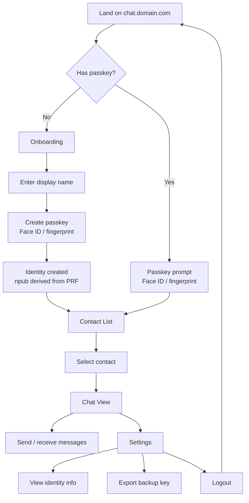

# Wireframes

## User Flow



## Screens

### 1. Landing / Onboarding

First visit. Clean, one action.

```
┌─────────────────────────────┐
│                             │
│       💬 QuickChat          │
│                             │
│   Chat with Xavier          │
│   Encrypted. No app needed. │
│                             │
│   ┌───────────────────────┐ │
│   │ Your name             │ │
│   └───────────────────────┘ │
│                             │
│   [ Start chatting →  ]     │
│                             │
│   ─────────────────────     │
│   🔒 Your messages are      │
│   end-to-end encrypted.     │
│   No account needed.        │
│   Powered by Nostr.         │
│                             │
└─────────────────────────────┘
```

After clicking "Start chatting" → browser passkey prompt (biometric).

### 2. Contact List

Who you can chat with. Configured by the site owner.

```
┌─────────────────────────────┐
│ 💬 QuickChat        ⚙️      │
├─────────────────────────────┤
│                             │
│  Messages                   │
│                             │
│  ┌─────────────────────────┐│
│  │ 🧑 Xavier               ││
│  │ Last: Thanks, talk soon  ││
│  │                    2m ago││
│  └─────────────────────────┘│
│                             │
│  ┌─────────────────────────┐│
│  │ 🤖 xbot                 ││
│  │ Last: PR is up, check it ││
│  │                   15m ago││
│  └─────────────────────────┘│
│                             │
│  ┌─────────────────────────┐│
│  │ 📜 Open Letter bot      ││
│  │ No messages yet          ││
│  │                          ││
│  └─────────────────────────┘│
│                             │
└─────────────────────────────┘
```

### 3. Chat View

Standard messaging UI. Bubbles, timestamps, encryption indicator.

```
┌─────────────────────────────┐
│ ← Xavier              🔒    │
├─────────────────────────────┤
│                             │
│        ┌──────────────────┐ │
│        │ Hey, how's the   │ │
│        │ project going?   │ │
│        └──────────────────┘ │
│                    10:32 AM │
│                             │
│ ┌──────────────────┐        │
│ │ Good! Just pushed │        │
│ │ the first commit. │        │
│ └──────────────────┘        │
│ 10:33 AM                    │
│                             │
│        ┌──────────────────┐ │
│        │ Nice, I'll take  │ │
│        │ a look.          │ │
│        └──────────────────┘ │
│                    10:34 AM │
│                             │
├─────────────────────────────┤
│ ┌─────────────────────┐ ↑  │
│ │ Type a message...   │ │  │
│ └─────────────────────┘    │
│            47/50 today      │
└─────────────────────────────┘
```

Note: "47/50 today" shows remaining rate limit.

### 4. Rate Limit Reached

```
┌─────────────────────────────┐
│ ← Xavier              🔒    │
├─────────────────────────────┤
│                             │
│        [chat messages...]   │
│                             │
├─────────────────────────────┤
│                             │
│  ⏳ Daily message limit     │
│     reached (50/50)         │
│                             │
│     Resets in 6h 23m        │
│                             │
└─────────────────────────────┘
```

### 5. Settings

```
┌─────────────────────────────┐
│ ← Settings                  │
├─────────────────────────────┤
│                             │
│  Identity                   │
│  ┌─────────────────────────┐│
│  │ Name: Alice              ││
│  │ npub: npub1a3f...7x2q   ││
│  │ NIP-05: alice@chat.xd..  ││
│  └─────────────────────────┘│
│                             │
│  Security                   │
│  ┌─────────────────────────┐│
│  │ 🔑 Export private key    ││
│  │ 📋 Copy npub             ││
│  └─────────────────────────┘│
│                             │
│  About                      │
│  ┌─────────────────────────┐│
│  │ Powered by Nostr         ││
│  │ Messages are end-to-end  ││
│  │ encrypted (NIP-17).      ││
│  │ Your key never leaves    ││
│  │ this device.             ││
│  └─────────────────────────┘│
│                             │
│  [ Logout ]                 │
│                             │
└─────────────────────────────┘
```

## Design Principles

1. **One action per screen.** Don't overwhelm.
2. **No Nostr jargon in the UI.** No "npub", "nsec", "relay" visible to regular users. Settings screen can show npub for power users.
3. **Encryption is default, not a feature.** Show 🔒 but don't make users think about it.
4. **Rate limits are friendly.** Show remaining count, not a punishment. "47/50 today" not "LIMIT: 3 LEFT."
5. **Instant.** Passkey login should feel like unlocking your phone. <1 second to chat.

## Wireframing Tool

For collaborative wireframe iteration, we recommend **Excalidraw**:
- Browser-based, no install
- Real-time collaboration via shared links
- Hand-drawn style keeps focus on flow, not pixel perfection
- Export to SVG/PNG for docs
- Files can be committed to the repo as `.excalidraw` JSON

Wireframe files live in `docs/wireframes/` as `.excalidraw` files.
